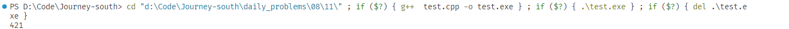

### [题目传送门](https://mp.weixin.qq.com/s/3VfXQcV-F2lnqxwmv91O0w)

### DS  
D  

A. 完全正确  
B. 不可能  (期待你王道明天是怎么说明他是错的, 你不会告诉我要把算next数组的时间也带上吧？)
C. 差不多的确是这样  
D. 无关  
```c++
//附上B选项的测试代码
#include <bits/stdc++.h>

using namespace std;

string generateRandomString(size_t length) {
    const string CHARACTERS = "0123456789ABCDEFGHIJKLMNOPQRSTUVWXYZabcdefghijklmnopqrstuvwxyz";

    random_device rd;
    mt19937 generator(rd());

    uniform_int_distribution<> distribution(0, CHARACTERS.size() - 1);

    string randomString;

    for (size_t i = 0; i < length; ++i) {
        randomString += CHARACTERS[distribution(generator)];
    }

    return randomString;
}

int matchSimple(string s, string t) {
    int i = 0, j = 0, n = s.size(), m = t.size();
    while(i < n && j < m) {
        if (s[i] == t[j]) {
            i++;j++;
        }else {
            i = i - j + 1; j = 0;
        }
    }
    if (j >= m) return i - m;
    return -1;
}


int matchKMP(string s, string t, vector<int> next) {
    int i = 0, j = 0, n = s.size(), m = t.size();
    while(i <= n && j <= m) {
        if (j == -1 || s[i] == t[j]) {
            i++;j++;
        }
        else {
            j = next[j];
        }
    }
    if (j >= m) return i - m;
    return-1;
}

vector<int> getNext(string s) {
    int n = s.size();
    vector<int> next(n);
    next[0] = -1;
    for(int i = 2; i < n; i++) {
        for(int j = i - 1; j >= 1; j--) {
            string a = s.substr(0, j);
            string b = s.substr(i-j, j);
            if (a == b) next[i] = j;
        }
    }
    return next;
}

int main() {
    size_t length = 1000;
    int cnt = 0;
    clock_t start,end;

    for(int i = 0;; i++) {

        string randomStr = generateRandomString(length);
        string randomPattern = generateRandomString(length);
        auto next = getNext(randomPattern);

        start = clock();
        matchKMP(randomStr, randomPattern, next);
        end = clock();
        auto t1 = start - end;

        start = clock();
        matchSimple(randomStr, randomPattern);
        end = clock();
        auto t2 = start - end;

        if (t1 - t2 > 0) break;
        cnt++;
    }

    cout << cnt << endl;
    return 0;
}
```  
执行结果
  
在简单随机抽样中， 样本的期望可以近似看做分布的期望，这里模型符合几何分布， 设简单匹配比KMP匹配的时间短的概率是P， 那么 $p^{421} (1-p) = \frac{1}{422}$ ,P近似为0
### CN  
A
忘了，不是算A就是算C    


### OS  
C  

分页和段页式没有外部碎片， 分页可以比段页式少存储一张段表， 使内存利用率较高


### CO  
A  
签到题 

### 昨日改错 