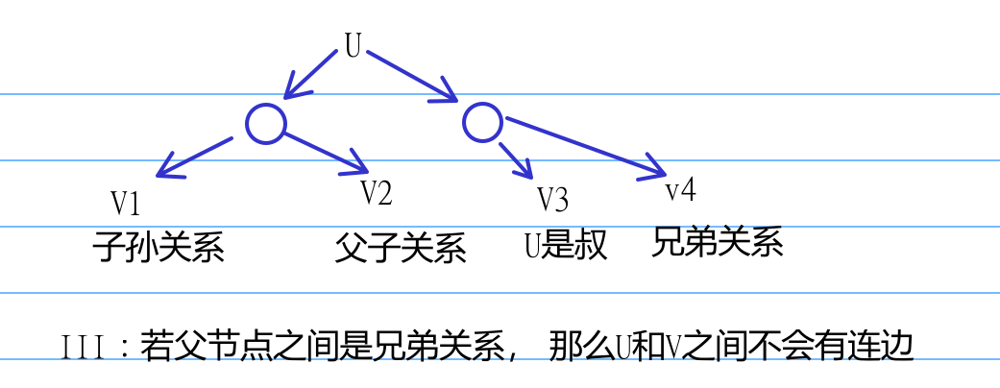
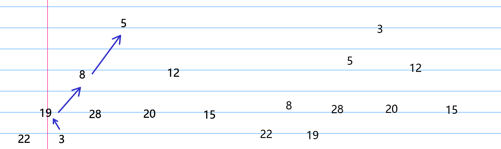

# 2009
## 选择题
1. B  
缓冲区一般都是队列
1. C  
仅在在一次出栈第一个元素时判断容量即可   
b出栈时， 栈内[a, b]  
d出栈时， [a, c, d]  
e出栈时， [a, e, f]
g出栈时， [a, g]  
最大容量为3
1. D  
3（R）在最开始， 接一下是1(N)， 那么接下来只能是(L)
1. B  
ACD根节点都不平衡， 平衡因子 $|2|$
1. C  
第六层本该有 $2^{6-1} = 32$ 个节点， 现在有8个叶节点， 那么剩下24个都有两个子节点时，节点数最多， 最多为 $2^6 - 1 + 24 * 2 = 111$ 个节点  
1. B  

1. A  
I: 每条边都会造成两个度， 所以最后肯定是偶数度  
II: 当边数等于顶点减一时， 也可能是无向连通图，， 此时退化成树的样子  
III: 当只有一个顶点时， III说法错误  
1. D  
D所述为B+树特点
1. A

1.  B  
A 冒泡排序 需要边缘2个数值为最大或最小， 不符合要求  
B 边缘2个有序  
C 边缘两个为最大或最小，不符合要求  
D 11 12为升序而13 7为降序，不符合要求
## 应用题
不可以， 举例， n = 4, edges = [[0, 1, 50], [1, 3, 1000], [0, 2, 100], [2, 3, 100]], 初始节点为0，目标节点为3