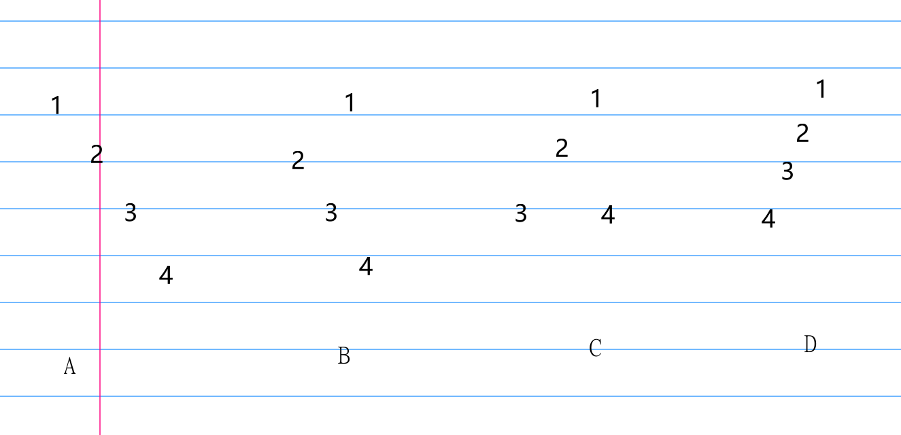
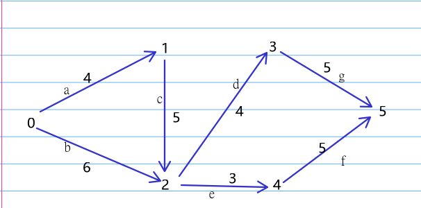

# 2011
## 选择题
1. A   
观察x序列2， 4， 8， 16，第t轮退出时是 $2^t > \frac{n}2$ , 那么时间复杂度就是 $O(log_{2}n)$  
1. B  
d e c b a  
d c e b a  
d c b e a  
d c b a e  
1. B  
想象第一次插入，由于插入操作不移动头指针， 所以头指针指向0， 尾指针 $r = (r+1)\mod n$ , 那么尾指针指向n-1
1. C  
偶数个节点的完全二叉树， 有一个 $n_1$ ， 剩下的节点满足 $n_0 = n_2 + 1$ ， 解得$n_0= 384$  
1. B  
直接无脑画图， 发现C的后序是3， 4， 2， 1
  
1. D  
结论：树中叶节点个数对应二叉树左节点为空的个数， 分支节点+1, 对应二叉树右节点为空  
解释：
* 对二叉树左节点为空意味没有孩子，所以对应叶子
*  所以对应树的叶子对于右节点为空可以从两个角度考， 一方面二叉树空链域为n+1, 而所以n+1-左域空（叶子） = 右域空（分叉+1）, 另一方面每个分叉节点的孩子构成的链，最右边孩子对应到二叉树的右链域为空， 而根节点会多一个， 所以是分支+1
1. A  
    查完91,然后查找22， 那么不可能再找91右边的94  
2. C  
    送分题， 唯一注意的点就是回路和简单回路的区别（是否经过重复点）  
3. B  
A. 显而易见， 应该减小  
B. 正确  
C. 这个不可避免， 是哈希函数和数据造成的， 几乎不可人为控制  
1.  A  
貌似这道题只能在AC里选， 对于链式需要双向指针， 无疑降低存储密度  
1.  B  
18与10比较一次， 18上浮， 18与25比较一次， 不变， 结束
## 应用题  
1):  
邻接矩阵：  
[  
[0, 4, 6, inf, inf, inf],  
[inf, 0, 5, inf, inf, inf],  
[inf, inf, 0, 4, 3, inf],  
[inf, inf, inf, 0, inf, 3],  
[inf, inf, inf, inf, 0, 3],  
[inf, inf, inf, inf, inf, 0],  
]  
2):  
  

3):  
|最早/最晚|0|1|2|3|4|5|  
|-|-|-|-|-|-|-|
|最早|0|4|9|13|12|18|
|最晚|0|4|9|13|12|18|  

|最早/最晚|a|b|c|d|e|f|g| 
|-|-|-|-|-|-|-|-|
|最早|0|0|4|9|9|12|13|
|最晚|0|3|4|9|10|13|13|  

可见关键路径为a,c,d,g,长度为16