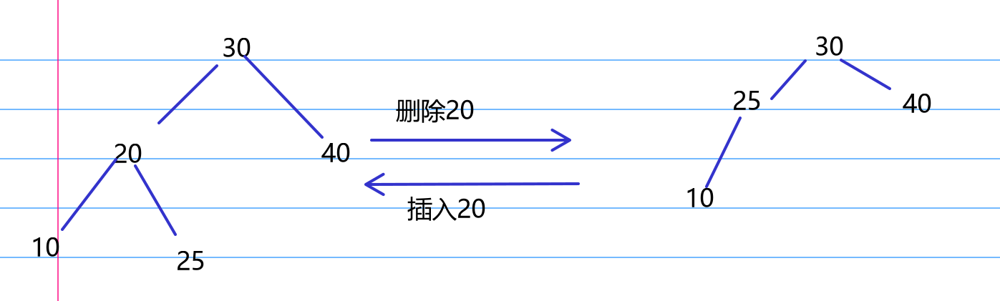
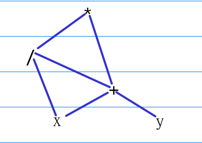
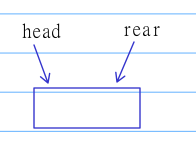
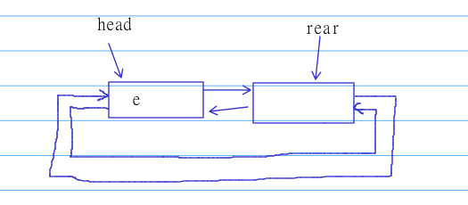

# 2019
## 选择题 
1. B  
第t轮退出时， 条件为 $(t+1)(t+1) > n$ ， 可知t的时间复杂度是 $O(\sqrt{n})$   
2. B  
先序转为前根， 中序转为后根  
3. C  
n个叶子的哈夫曼树有n-1个分支，所以 $2n-1=115$ ，解得n=58  
4. A  
若是叶节点，那么删除后可能导致树的旋转调整，所以可能不同  
若是非叶节点，删除后会用前驱或后继来取代，再次这个节点时插入时必为分支节点， 若此时未引起不平衡，则肯定不同，但是引起不平衡将导致旋转， 那么此时树就可能和原来相同  
例子：
  
5. C  
  |1|2|3|4|5|6|  
  |-|-|-|-|-|-|  
  |0|12|8|19|8|27|  
  ||12||21|18|27|

    d的开始为2（12）,末尾为(21-7=14)    
6. A  
如图五个节点即可  
  
7. D  
A当数据范围较小时， 可以采用直接插入排序，冒泡等等  
B当是链式存储时，不宜用希尔或者堆  
C比如比赛的排名， 先达到分数的玩家不能排在后面  
D数据基本有序时冒泡几乎是O(n),而快排会退化为 $O(n^2)$   
8. C  
哈希表内为[98, 22, 30, 87, 1, 40, 6, 20, 0, 0, 0], 位置0需要比较9次， 位置1八次...位置6三次， 共42次， 平均6次  
9. B  
写出模式串的next数组[-1,0,0,1,1,2],在最后一个字母失配时， 从第2个开始匹配，因此仅主串依次匹配abaabaaabc  
10. D  
D如果不是边界元素归位， 那么第二趟结果需要三个元素归位， 而D只有两个
11. B  
直接上公式即可 $119\mod 11=9, 12-9-1=2$ ， 这里可以给出公式简要说明，（ 具体证明利用度数和节点的关系，这里不说明），因为$119 \mod 11=9$说明多出来九个段没有匹配, 那么这时需要从已经归并好的树拿下来一个叶子，用分支替代，这时成了10个归并段未加入， 所以需要k-10(12-10)个虚段
## 应用题
解析：  
看到入队操作要求O(1)，且占用空间可增时， 就要意识到用链表，题目空间可重复利用， 意识到是循环链表  
1):  
链式结构  
2):  
   
队空: head == rear  
队满: rear->next == head
3):  
  
4):  
```c++
void push(int e) {
    if (rear->next == head) { //如果队满就先添加一个位置
        auto s = new node();
        s->next = rear->next;
        s->pre = head->pre;
        rear->next = s;
        head->pre = s;
    }
    rear->val = e;
    rear = rear->next;
}

void pop() {
    if (rear != head) rear = rear->pre; //如果队不空就删除
}
```
