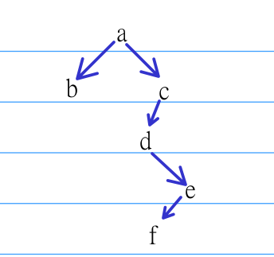

# 2020
## 选择题  
1. C  
前六行有 $1+2+3+4+5+6=21$ 个节点, m是第7列第二个， 所以是第23个， 对应下标22  
做这种题需要注意：是行优先还是列优先， 是上三角还是什么其他的矩阵  
1. D  
签到题  
1. A  
高度为5最多有31个节点,直接开31个就行  
1. C  
森林的先跟对应二叉树的先序，森林的中跟对应二叉树的中序， 可以画出确定的二叉树结构  
  
对应的后序为bfedca  
1. B  
1不能比2先插入  
1. B  
一直遍历到最深处, 此时节点没有出度,输出,遍历后弹栈,遍历其父亲时选择其他分支遍历到最深处,依然没有出度,输出,回到父节点时,其所有指向的节点都已遍历,此时弹栈父亲节点,可以发现是逆拓扑有序序列  
1. A  
依次加入权值小的边,加入前判断是否连接的两个节点在一个集合内,若在则不加入,否则选择次边,不难模拟出A  
1. B  
AB. B是正确定义,A错误  
C.增加任意关键活动时间会延长工期  
D.缩短任一关键活动的时间可能导致其变成非关键活动,此时不能缩短工期  
1. B  
iii. 错误,堆中的根是同时大于左右子树,且不保证左右子树大小关系,所以不是二叉排序树  
1.  B  
模拟过程即可,注意在13和12时分裂即可  
1.  A  
i. 如果有序,直接插入对比O(n)， 简单插入对比 $O(n^2)$  
ii. 两者都不需要额外存储  
iii. 移动次数差不多,没有显著区别 
## 应用题  
1):  
二叉树  
2):  
从树根开始， 如果碰到0字符，往左走， 碰到1字符， 往右走， 到达叶子时， 一个字符译码完成， 这时叶子应包括相对应的字符，然后如果0/1串后面还有字符， 那么接着从树根开始遍历  
3):  
把编码规则映射为二叉树， 若编码对应的字符出现在分支节点， 那么就不具有前缀特性