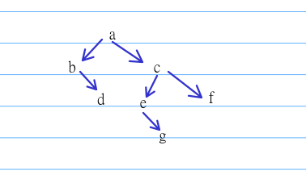
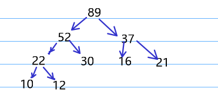
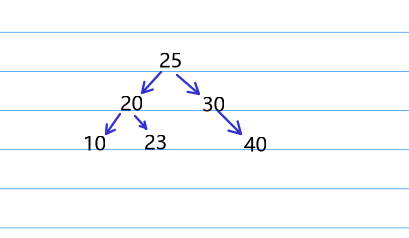

# 2021
## 选择题  
1. D  
签到题  
1. D  
1和2之间不能隔着3的  
1. B  
设一行x个元素，那么可得 $100+3x+3 = 200 => x = 39$ , 那么 $100+5x+5=300$  
1. C  
直接画出T的图， 可以看出森林有三颗树  

1. B  
签到题，画出哈夫曼树即可  
  
1. D  
最小不平衡子树是以根为节点，那么右旋加左旋调整即可，最终树为  
  
1. A  
唯一序列ABCDEF  
1. C  
    |第n轮|1|2|3|4|5|
    |-|-|-|-|-|-|
    |初始|0|26|3|$\infty$|6|
    |第一轮后|0|25|3|$\infty$|6|
    |第一轮后|0|21|3|14|6| 

    变化过程如图  
2. A   
要让节点尽量多， 就要让第二层节点尽量多， 最多是有三个节点，第一个， 第二个节点一个关键字， 第三个两个， 那么第一层一个节点+第二层三个节点+第三层七个节点=>11  
1.  C  
372之前的元素，为序列中各位为2的第一个元素（如果是372， 就是各位为1的最后一个元素301）， 之后的第一个元素为372后的第一个各位为2的元素（如果是372， 就是各位为3的第一个元素），综上选301,892  
1.  B  
模拟一遍过程就行， 签到题
## 应用题 
初步分析：  
看函数名就是到函数功能是排序， 更具体的问题下面分析
1):  
-10, 10, 11, 19, 25, 25  
2):  
$n-1+n-2+ \dots +1 = \frac{n(n-1)}{2}$  
3):  
分析：  
count数组的本质是位置为j的元素前面有几个比他大，本题中， 若要稳定， 则比较元素相同时， 应认为后面元素大， 这样做相同元素后面的会排在前面的后面， 即应该给count[j]++;  
答案：  
不稳定， if(a[i] < a[j]) 改为 if (a[i] <= a[j])