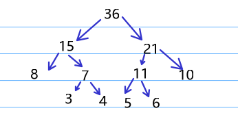
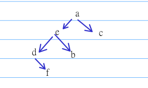

# 2023
## 选择题
1. D  
签到题， 除了获取第i个位置的元素外， 其他三个操作平均时间复杂度都是O(n)  
1. C  
A第一句错误  B第一句错误  C正确  D第一句错误  
1. A  
还要保存表的大小， 这个可以用行数和列数表示  
1. C  
可见平均查找长度为 $\frac{18*2+18*3}{36} = 2.5$  
  
1. B  
能懂后序遍历和先序遍历即可做对， 恢复后的树如下  
  
1. B  
prim和kruskal均是求最小生成树的算法， 而bfs可以通过每次向外一圈，距离+1的操作计算出所有节点最短路（前提是所有边权值相同）  
1. B  
i: 正确，插入可能导致树的分裂  
ii: 正确，若删除的是叶节点那么肯定会变化， 若删除的是非叶节点会用直接前驱或直接后继代替，那么还是会修改叶节点
iii: 错误，非叶节点也会保存关键字， 非叶节点保存索引是b+树的操作  
iv: 错误，可以插到非叶节点上  
1. B  
考察折半查找判定树1的最大高度 $\lceil log_2 (600+1) \rceil = 10$  
1. C  
哈希表内[空,2022,删除,空,25],那么平均查找长度为 $\frac{1+3+2+1+2}5 = 1.8$   
1.  C  
签到题  
1.  D  
找一个元素， 左边都比他小，右边都比他大即可  
## 应用题
42  
1):  
直接模拟就行  
三个  
[37, 51, 63, 92, 94, 99]  
[14, 15, 23, 31, 48, 56, 60, 90, 166]  
[8, 17, 43, 100]  
2):  
最少为m个， 比如降序  
最多位n个， 比如升序  