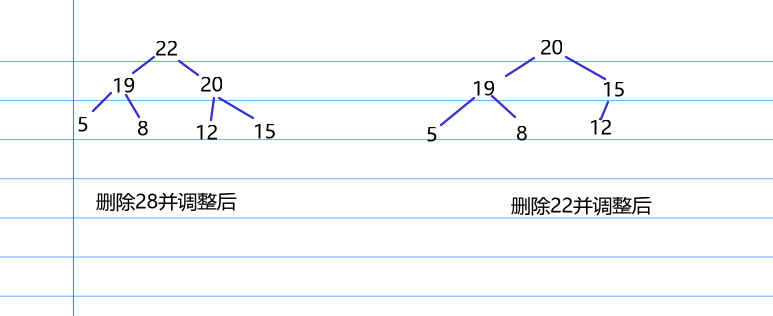

# 2024
## 选择题  
1. D  
先把p->next节点拿下来然后放到表头
1. A  
当入栈运算符低于或等于栈顶元素，就持续出栈，模拟可得xyzu-*v/+  
1. A  
若p有右孩子，那么访问完p后肯定访问p的右孩子而不是v， 若q有左孩子，那么访问完v后肯定访问q的左孩子而不是q  
1. B  
邻接多重表的度，~~就是从顶点的边指针和边的指针顺着边去找， 直到空节点,长度即为度数，  b的边[[1,3], [0,1]]， d的边[[3,0], [4,3]], 吐槽， 我真的不理解， 为什么设计的邻接多重表不让d指向[1,3]边（起始边），你非要大家看全表然后数个数才满意吗，那你这样考察的话，为什么不直接给出边集而是邻接多重表呢~~解析：直接数个数b[[1,3],[0,1]], d[[3,0],[4,3],[1,3],[2,3]],个数为2,4  
1. D  
不论是否有序， 链表都不行， 当然无序数组肯定不行  
1. A   
修正后的next数组为[-1, -1, 1, -1, -1], 可见最差是从位置4滑到位置-1， 长度为5  
1. D  
可见关系k1 < k3 < x < k2  
1. A  
中轴唯一特点：左边都小于等于它，右边全大于等于它  
A. 正确  
B.块内不保证有序  
C.p和q都有可能一个是空集  
D.中轴两边挨着的元素可能相同  
1. B  
  
1.  C  
共5次比较,分别是[[3,7],[5,7],[3,6],[5,6],[6,7]]  
1.  D  
签到题，最高节点保存冠军的节点（升序中冠军就是最小节点）
## 应用题  
解析：  
出哈希表就是来送分的， 若只题不多评价  
42:  
1):  
[11, 空, 14, 7, 空, 20, 9, 空, 空, 3, 18]  
装填因子为7/11  
2):  
9 10 2  
3):  
先找2发现冲突，然后找3发现冲突，然后找6发现冲突，然后找0发现冲突，然后找7发现失败

