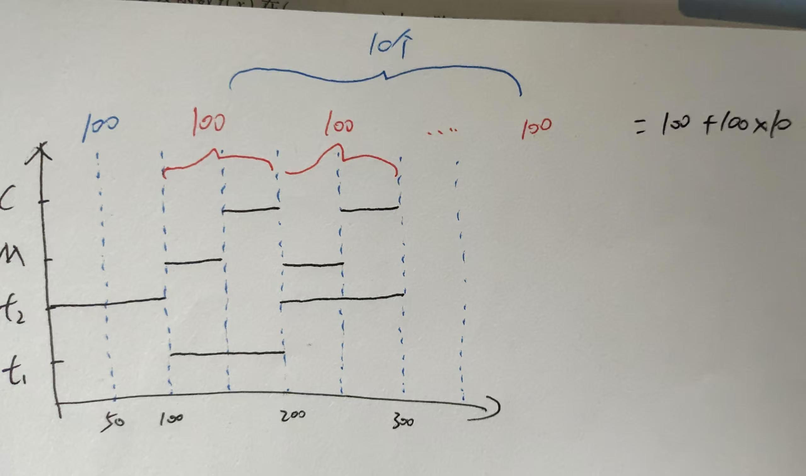

# 2011

## 选择题

23. B

    满足短作业优先的就是短任务优先算法和高响应比优先算法， 不会死锁的就是高响应比优先算法

24. A

    签到题，若命令解释程序都要在内核态执行， 那就需要很频繁的变态， 而且命令解释程序基本不会涉及需要内核完成的操作（命令解释程序就是常说的bash， sh， zsh等等）

25. D

    进程的各个线程都有自己的栈指针，但是共享堆指针

26. B

    签到题

27. D

    回收p1, p4后发现， p2和p3都需要3个r2, 此时不能满足， 故不存在安全序列

28. D

    拿入一页就需要修改页表的存在位，算法位等等，缺页必将伴随磁盘IO， 若是全局置换，那么可能就需要分配一个页框

29. A

	1. 撤销部分进程让页面空出来,这样就有更多空页面存放进程页面， 解决抖动
	1. 这没用，该缺还是缺， 而且对换区容量一般很够
	1. 这会影响进程调度情况， 而不会影响抖动发生，该换出还是会被换出

30. C

​	编译形成单个模块的逻辑地址， 连接形成整个程序代码段的逻辑地址，装在时逻辑地址转为物理地址

31. B

​	单缓冲草稿不见了。。。

​	双缓冲如下
​      

32.  C

若正确先执行进程1后执行进程2，那么结果就是1， 若在load后store前切换， 那么结果分别就是0， 2

## 大题

45

```
semaphore empty = 10
semaphore mutex = 1
semaphore full = 0
semaphore service = 0

consumer_i {
	p(empty)
	p(mutex)
	取号
	v(mutex)
	v(full)
	p(service)
	获取服务
}

营业员 {
	while(1) {
		叫号
		p(full) //注意：若顾客是先v后p，这里最好就是先p后v，这样形成一种互相等待的局面
		v(service)
		为顾客服务
	}
}
```

***

46

1.  连续方式好， 因为不会修改移动数据，这就避开了连续存取的缺点， 使文件读取快且可以随机访问，需要增加其实块号和长度
2. FCB集中存取， 当文件FCB太大时，一个磁盘块所能存储的FCB会很少， 当要检索一个文件FCB时，就可能需要读取更多的磁盘块，而IO是一个很慢速的操作，若采用集中存储， 每个磁盘块的存储密度为变高， 找到文件对应的目录项时，可以根据索引指针直接找到FCB， 加快平均查找速度